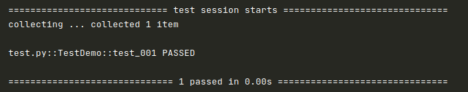
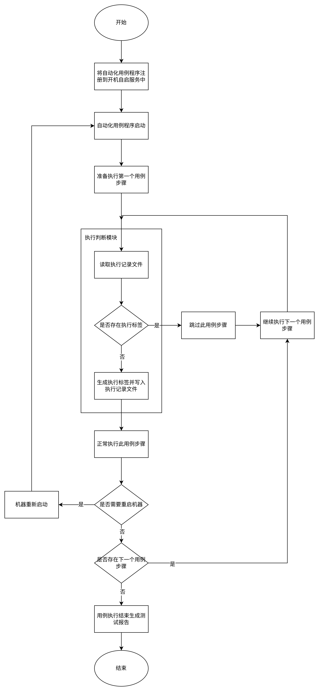
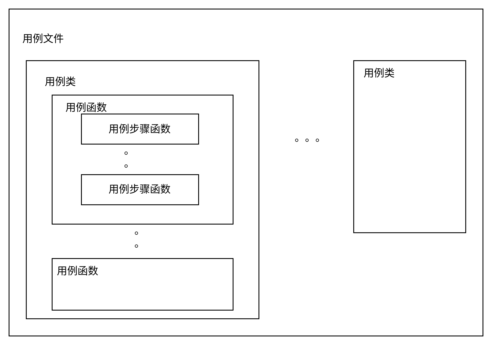

# Let Me Go

任我行（letmego）是一个控制 Python 函数执行的技术方案，目前主要应用场景是在自动化测试程序遇到不得不中断的场景下，如重启场景，需要实现自动化用例步骤执行过程中重启机器，机器重新启动之后，能再次继续紧接着重启前的用例步骤执行的功能。

## 安装

- 从 PyPI 安装:

  ```shel
  pip3 install letmego
  ```

## 使用

方法层：

```python
{!../test/page.py!}
```

使用方法非常简单，只需要在方法层类名加一个装饰器即可。

在测试用例中调用方法：

```python
{!../test/test.py!}
```

测试用例首次执行，执行结果如下：


同时会生成标签文件：

`_running_man.log`

```python
{!../test/_running_man.log!}
```

再次执行用例，测试用例实际没有执行任何东西：



## 技术方案讲解

本技术方案通过对自动化测试代码中执行到的函数进行动态添加执行标签，在每次会话过程中，只要执行到的用例步骤都会通过标签的形式记录此函数的执行状态，而标签字符串是通过一套组合算法对函数进行标记，从而确保每个函数标签全局唯一性。

以重启场景为例，整体运行逻辑如下：

首先，将自动化测试程序注册到操作系统开机自启服务中，这样只要操作系统开机，自动化测试程序就会自动执行起来。

然后，在一次自动化测试用例执行时，每个用例步骤为一个函数，用例步骤执行时通过标签记录此步骤已经被执行了，记录到执行记录文件里面，如果某个用例步骤涉及重启的操作，虽然当前自动化程序会中断，但是执行记录文件里面已经记录了重启之前执行到哪个步骤了。

最后，等重新启动之后，执行判断模块会读取执行记录文件里面的标签信息，如果自动化用例步骤所对应的函数已经存在执行记录文件中，说明这个用例步骤在重启之前已经执行过了，则直接跳过执行，继续判断下一个步骤，直到判断到某个用例步骤的标签不存在执行记录文件中，说明此用例步骤就是重启后应该紧接着执行的用例步骤，因此正常执行此用例步骤即可。

这里先不考虑用例断言，因为用例断言本质上也是一个用例步骤，只是通常是做一些值的对比判断，所以，为了容易理解，上述的用例步骤执行就已经包含了用例断言的概念。



图（一）用例步骤中重启中断后恢复执行的流程

### 注册开机自启服务

将自动化用例执行程序注册到开机自启服务中，确保用例执行过程中，机器重启后程序能自动的被拉起执行。

```python
import letmego

letmego.register_autostart_service(
    # 系统当前运行用户的用户名
    user="uos",
    # 自动化程序所在的路径
    working_directory="/home/uos/youqu/",
    # 自动化程序的执行命令
    cmd="pytest ."
)
```

### 执行判断模块

执行判断模块负责在每个用例步骤执行时，读取执行记录文件，如果该用例步骤所对应的标签已经存在，说明此用例步骤被执行过，则跳过执行，反之，则正常执行。

### 执行记录文件

执行记录文件里面记录的是已经执行过的用例步骤标签，标签采用一套组合算法，将用例步骤的函数对象转换为唯一的字符串，即使在同一条用例中多次调用了相同的用例步骤函数，其对应的标签字符串也是不同的，确保用例中的每个步骤函数的标签字符串全局唯一性。

### 用例步骤函数标签字符串编码算法

由于用例步骤函数是可复用的，也就是说即使是在同一条测试用例里面，可能出现多个完全相同的用例步骤函数的调用，因此我们需要有一种算法来确保每个步骤所对应的标签字符串的唯一性，而且标签字符串还应该具有可逆性，就是说当执行判断模块读取到某个标签字符串时，通过解码能快速的知道它是否为当前执行的用例步骤函数，这就是可逆性。

用例步骤在执行时，通过以下 5 个关键信息进行编码组合：

（1）用例代码的文件路径；

（2）用例类的类名；

（3）用例函数的函数名；

（4）用例步骤的函数名称；

（5）用例步骤函数所在文件的代码行数；

根据以上 5 个关键信息，经过编码组合后就可以生成一个具有唯一性、可逆性的标签字符串。

这里简单说明一下上述 5 个关键信息之间的关系：

（1）一条自动化测试用例是写在某个用例文件（也可称为用例脚本文件或简称脚本文件）里的，用例文件的路径就包含了文件所在系统中的路径和文件名称。

（2）基于面向对象的软件开发思想，在用例文件中，会以类的形式进行用例代码的编写，在类里面所定义的函数就是测试用例函数，而在测试用例函数里面是调用的用例步骤函数（方法）。

（3）用例步骤函数所在文件的代码行数是用于区分在用例函数中，多次调用相同的用例步骤函数的情况。



图（二）用例步骤函数标签字符串编码算法几个关键信息的关系

代码示例如下：

`test.py`

```python
{!../test/test.py!}
```

- test.py 是用例文件，它在操作系统中是存在一个路径的；
- TestDemo 是用例类类名；
- test_001 是用例函数的函数名称；
- click_some_element_self 是用例步骤函数，它来源于 page 模块的 Page 类，而且可以看出它在第 10 行和第 14 行都有调用；

### 用例执行状态的处理

以前面的描述处理单条用例执行时的逻辑；

那么，多条用例之间如何进行衔接处理呢，而且还有个问题，就是前面执行过的用例，第二次执行的时候实际没有执行的内容，但用例结果是 PASS，而有可能前面的用例执行状态是 FAILED，也就是说对于用例的执行状态如何处理？

这部分需要在自动化测试框架里面做逻辑处理，letmego 里面提供相应的方法，框架负责调用即可。

处理逻辑如下：

（1）每条用例执行结束之后，在标签记录文件里面记录用例的执行状态，这里的状态不代表用例成功或失败，而仅仅是标识此用例是否已经被执行过；

```py
import letmego

letmego.write_testcase_running_status(item, report)
```

（2）在用例收集阶段读取标签记录文件里面，并将已经记录到文件中的用例，剔除用例集。

```py
import letmego

letmego.read_testcase_running_status(item, reruns=None)
# 返回 True 说明用例已经执行过，False 说明未被执行过；
```

经过以上逻辑处理，确保第二次执行时，前面已经执行完成的用例不用再执行，直接从涉及重启步骤的那条用例开始执行，根据前面的运行流程图，重启步骤及前面的步骤直接跳过，后续步骤将正常执行。

## 集成到自动化测试框架

集成到框架中需要处理一下几个事情：

- 注册自启服务；
- 处理用例集；
- 记录执行次数
- 记录用例的执行状态；
- 测试报告整合；

这里面“记录执行次数”是存在重跑机制的情况下需要处理的，而且由于重跑的次数是由框架来控制的，因此需要将框架指定的重跑次数，传递给 letmego 中，从而在每个用例步骤才能记录它们是第几次执行的；

以上这些一定需要小心处理，从处理难度上讲甚至超过了 letmego 本身的实现难度，你必须对自动化测试框架每个阶段的执行逻辑了若指掌；

如果你是使用的 [有趣（YouQu）](https://github.com/linuxdeepin/deepin-autotest-framework) 那就可以放心使用，此框架已经完美集成了本技术方案；

## 其他容易忽视但很重要的事项

- 用例的前置和后置要写在同一个用例文件里面；
- 重启步骤前面的步骤，如果有对象实例化的，需要处理实例化存在异常；
- 重启步骤最好是一个简单的reboot操作，不建议在组合步骤中间插入一个reboot；

## Demo

我们提供了一个 [Demo](https://github.com/mikigo/letmego/tree/demo) ，包含了 letmego 的完整应用过程以及各关键细节的处理方法，如有问题，欢迎提交 issues~~